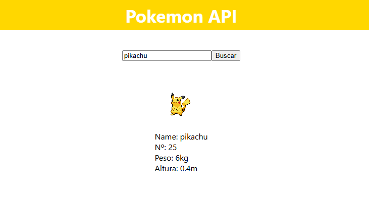

<h1 align="center">Pokedex</h1>

 Este projeto é uma Pokédex interativa desenvolvida em React, que consome a PokéAPI para buscar informações detalhadas sobre qualquer Pokémon. Com uma interface simples e intuitiva, os usuários podem pesquisar por nome ou número e visualizar detalhes como nome, número na Pokédex, peso, altura e a imagem oficial do Pokémon. 
<a href="https://guilhermesandrade.github.io/Pokedex/">Teste aqui o Projeto</a>

<h1 align="center"> 👀 Resultados</h1>

 
 

<h1 align="center"> 💻 Sobre o Projeto</h1>

A aplicação permite:

- Busca de Pokémon em tempo real: O usuário pode inserir o nome ou número do Pokémon no campo de busca e, ao clicar em "Buscar", as informações são carregadas dinamicamente.
- Consumo de API (PokéAPI): Utiliza requisições HTTP para acessar os dados detalhados de cada Pokémon.
- Interface amigável: Um layout limpo, com um cabeçalho em destaque e exibição clara dos detalhes do Pokémon.
- Gerenciamento de estado: A aplicação utiliza o useState e useEffect para gerenciar e atualizar os dados obtidos da API.

<h1 align="center">🚀 Tecnologias usadas:</h1>

- React para a construção da interface.
- PokéAPI para fornecer os dados.
- CSS para a estilização personalizada.</a>

 
